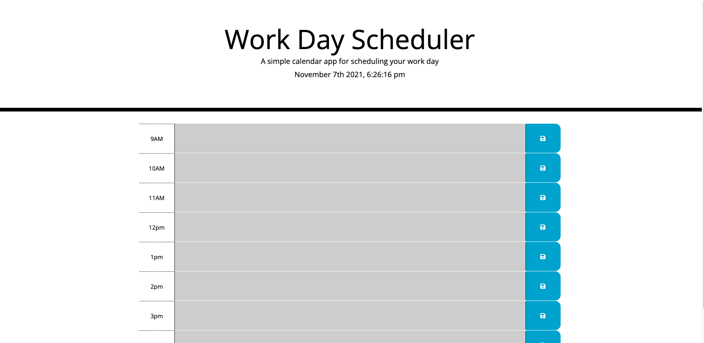

# Work Day Scheduler

## This spin on a daily planner was built for the busy employee who is looking to manage their time more effectively!

### Project is created with:
- HTML

- CSS

- JavaScript

- Bootstrap

- JQuery

### As a user, once you open the application you will:

- See the current date and time displayed at the top of the calendar

- Scroll down to find time blocks for standard business hours

- See that each time block is color-coded to indicate whether it is in the past, present, or future

- Be able to click on a time block, enter an event and be able to save that event

- Be able to close or refesh the page as the data will be saved in local storage 

### URL [Work Day Scheduler](https://dennisdown.github.io/scheduler/)
